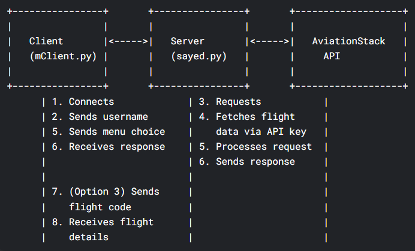

# Multithreaded Flight arrival Client/Server Information System

## Project Description:
The Multithreaded Flight Arrival Client/Server Information System is a Python-based application designed to provide real-time flight status updates using the AviationStack API. The system consists of a server application (sayed.py) and a client application (mClient.py). The server connects to the AviationStack API to fetch the latest flight data, manages multiple client connections simultaneously through multithreading, and stores the retrieved flight information in JSON format for efficient access. Clients interact with the system via a command-line interface, where they can view lists of arrived or delayed flights, search for specific flights by their code, and receive up-to-date information. The client-server architecture ensures that multiple users can access flight data concurrently, making the system suitable for environments where timely and accurate flight information is essential.  

## Semester
Second Semester 2024/2025

## group members
* Group Name: SA13
* course code: ITNE352
* sec: 01
* SAYED ALI ADNAN 202109837 
* mohammed

## table of contents
1. [Project Description](#project-description)
2. [requirements](#requirements)
3. [how to run the project](#how-to-run-the-project)
   * [run the server code](#run-the-server-code)
   * [run the client code](#run-the-client-code)
4. [API Key](#api-key)
5. [Example Usage](#example-usage)
   * [Server Output](#server-output)
   * [Client Output](#client-output)
6. [System Architecture](#system-architecture)
7. [Error Handling](#error-handling)
8. [Client-Server Communication and API Data Flow](#client-server-communication-and-api-data-flow)
9. [Security (SSL/TLS Support)](#security-ssltls-support)
10. [conclusion](#conclusion)   

## requirements
* Python 3.x
* install the required libraries using pip:
```bash
pip install requests
```
# how to run the project
## run the server code
1. Open a terminal and navigate to the directory where the server code (sayed.py) is located.
2. Run the server code using the following command:
```bash
python sayed.py
```
3. The server will start listening for incoming client connections on the specified host and port (default is localhost:'127.0.0.1').
4. The server will fetch flight data from the AviationStack API and store it in a JSON file (flights.json) for efficient access.
5. The server will handle multiple client connections simultaneously using multithreading.

## run the client code
1. Open a new terminal and navigate to the directory where the client code (mClient.py) is located.
2. Run the client code using the following command:
```bash
python mClient.py
```
3. The client will connect to the server and display a menu with options to view arrived flights, delayed flights, search for a flight by code, or exit the program.
4. The client will send requests to the server based on user input and display the corresponding flight information.


## API Key
API URL: http://api.aviationstack.com/v1/flights?access_key

API Key: 1d14536c4196c2d80900fd9ac26fb84a


## Example Usage
### Server Output
```bash
Server started on
Enter ICAO code of airport(e.g, OBBI): obbi
Data saved to SA13.json
Server listening on 127.0.0.1: 9090...
connected with ali at ('127.0.0.0', 56038)
```
### Client Output
```bash
Enter youer name: ali
Menu:
1. Get Arrived Flights
2. Get Delayed Flights
3. Search Flight by Code
4. Quit
Select an option (1-4): 3
Enter flight ICAO code : G917
Flight Details:
 Flight: G917
To: Bahrain International, Terminal: 4, Gate: 13
Status: landed
Scheduled Departure: 2025-05-14T18:20:00+00:00
Scheduled Arrival: 2025-05-14T18:30:00+00:00
Select an option (1-4): 1
Arrived Flights:
all flights have arrived
Select an option (1-4): 2
Delayed Flights: 
all delayed flights have arrived
Select an option (1-4): 4 
quit program
```
## System Architecture
* Client/Server: The client sends requests to the server via TCP, and the server responds with the requested data.
* Multithreading: Each client is handled in a separate thread to ensure fast response and support for multiple users.

## Error Handling
* The system handles errors such as unavailable data, wrong flight codes
* Clear messages are shown to the user if any error occurs.

* Features
View arrived flights.
View delayed flights.
Search for flight details by flight code.
Supports multiple clients at the same time (multithreading).

## Client-Server Communication and API Data Flow
* The client sends a request to the server for flight data.
* The server fetches the data from the AviationStack API and processes it.
* The server sends the requested data back to the client.
* The client displays the data to the user in a user-friendly format.


[](image.png)


[](image-1.png)


## Security (SSL/TLS Support)
For enhanced security, this project can be extended to support SSL/TLS encryption. By enabling SSL/TLS, all communication between the client and server will be encrypted, protecting sensitive data from interception or tampering. This is recommended for real-world deployments.


## conclusion
The Multithreaded Flight Arrival Client/Server Information System is a robust and efficient solution for real-time flight status updates. By leveraging the AviationStack API, the system provides accurate and timely information to users, making it an essential tool for travelers and aviation enthusiasts alike. The use of multithreading allows for concurrent client connections, ensuring that multiple users can access flight data simultaneously without any performance degradation. Overall, this project demonstrates the power of Python in building scalable and responsive applications in the field of aviation information systems.


